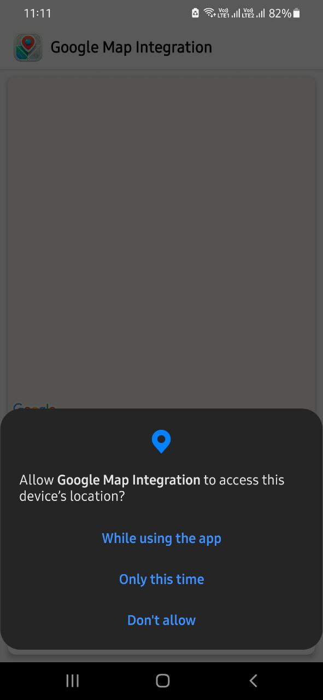
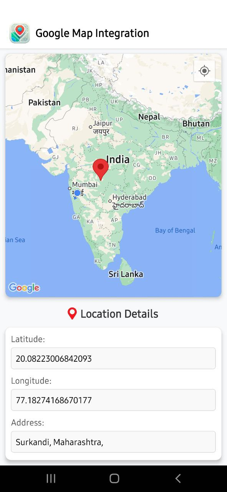

# Google Map Integration


## Overview
This project demonstrates the integration of Google Maps in a React Native application. The app provides the following features:

1. **Location Permission**: The app asks for location permission on the first screen.
2. **Interactive Map**: Tapping on any location on the map displays its latitude, longitude, and address.

---

## Features

### Location Permission Screen
- Prompts the user to allow location access.

### Interactive Map
- Displays a Google Map.
- On tapping a location, shows the latitude, longitude, and address.

---

## Screenshots

### Location Permission Screen


### Map Screen


---

## Installation and Setup

### Technologies Used
- **React Native**: A framework for building native apps using React.
- **Expo**: A platform for developing and building React Native apps.
- **Google Maps API**: For interactive maps and geolocation.

### Prerequisites
- Install [Node.js](https://nodejs.org/).
- Install the [Expo Go App](https://expo.dev/client) on your device.

### Development Mode
1. Clone this repository:
   ```bash
   git clone <repository-url>
   ```
2. Navigate to the project directory:
   ```bash
   cd google_map_integration
   ```
3. Install dependencies:
   ```bash
   npm install
   ```
4. Start the project:
   ```bash
   npx expo start
   ```
5. Scan the QR code displayed in the terminal using the Expo Go app.

### Building the APK
1. Place your API key in the android.config.googleMaps.apiKey field in the app.config.json file
2. Create an Expo Application Services (EAS) account.
3. Build the APK with the following command:
   ```bash
   eas build -p android --profile preview
   ```
4. Download the APK from the provided link after the build is complete.

---
